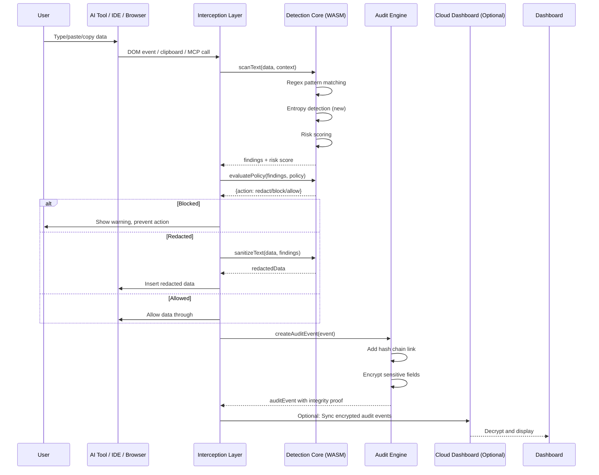
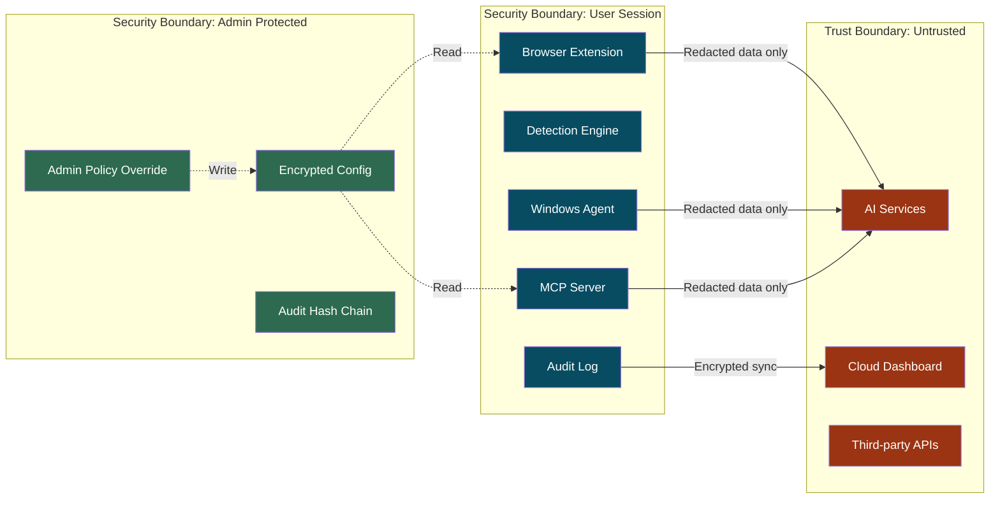
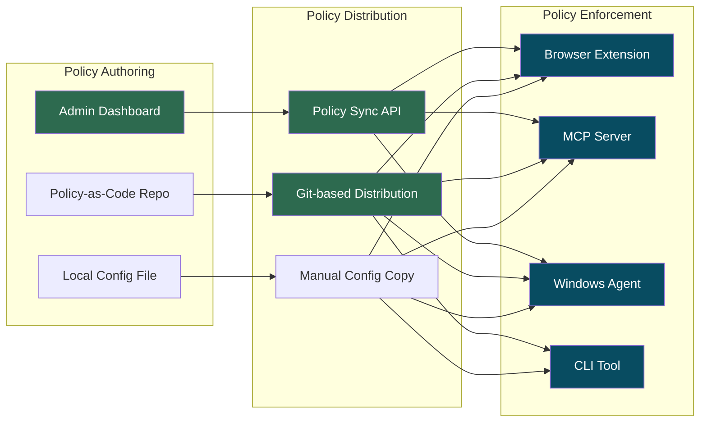

# Maskit Platform Improvement Plan

**Author:** Senior Security Architect & Product Strategist  
**Date:** July 2026  
**Status:** Strategic Planning Document  
**Classification:** Confidential

---

# 1. Executive Assessment

## 1.1 What Maskit Actually Is Today

Maskit is a **local-first browser extension** with an attached MCP server that detects and redacts sensitive data (API keys, PII, financial info) before it reaches AI chat interfaces. It uses deterministic regex matching, runs zero cloud infrastructure, and stores audit logs locally. A Windows clipboard agent is in early development.

**Status:** The core extension works. Detection is functional. The architecture is clean. The MCP server is a legitimate differentiator.

## 1.2 Market Category

Maskit occupies a hybrid position:

| Category | Fits? | Evidence |
|----------|-------|----------|
| Browser DLP extension | Yes | Core functionality matches |
| AI Security (AISec) | Partially | Protects AI data entry but has no model scanning, no LLM security |
| Developer security tool | Partially | MCP server, CLI, integrations point this way |
| Endpoint DLP | No | No file monitoring, USB control, network inspection |
| Cloud DLP | No | No backend, no API |

**Verdict:** Maskit is a **browser-based AI data entry protector** with ambitions to become broader. It is not yet a platform.

## 1.3 Startup Potential

**Moderate — but real, with caveats.**

| Factor | Assessment |
|--------|-----------|
| Market need | Real and growing. AI adoption creates data leakage risk that existing tools ignore. |
| Differentiation | Local-first processing is genuinely different from cloud-based competitors. |
| Defensibility | Low. Regex patterns can be copied. No network effects. No proprietary data. |
| Revenue model | None currently. Free extension. Enterprise monetization unclear. |
| Team fit | Single-owner project. Needs engineering, product, sales, marketing. |
| TAM | Large (millions of developers + enterprises using AI tools), but willingness to pay unproven. |

**The honest assessment:** Maskit could become a viable niche business or a feature-acquisition target. It is unlikely to become a $100M ARR company without significant investment and a clearer enterprise go-to-market.

## 1.4 Strongest Competitive Advantage

**Local-first MCP integration.** No competitor has a local MCP server that intercepts data at the AI tool protocol level. This is genuinely novel. The fact that Maskit can sit between Claude Desktop and its model — without sending data to any cloud — is a real technical moat for privacy-conscious buyers.

## 1.5 Biggest Risks

| Risk | Severity | Details |
|------|----------|---------|
| Browser extension fragility | Critical | Content script interception breaks when sites update their DOM. ChatGPT, Claude, Gmail can break Maskit with any frontend deployment. Ongoing maintenance burden. |
| No revenue | Critical | Zero revenue means zero runway. No funding mentioned. |
| False claim exposure | High | Website claims "WebAssembly engine" and "WASM" — codebase shows vanilla JavaScript. This is a legal/compliance risk. |
| Competition awakening | High | Microsoft Purview, Netskope, and Cyberhaven are all adding AI DLP. They have existing enterprise distribution. |
| Single point of failure | High | One developer. No bus factor. |
| Regex arms race | Medium | Sophisticated users can obfuscate data to bypass regex (base64, splitting, encryption). |
| Enterprise sales complexity | Medium | Selling to enterprises requires SOC2, HIPAA, GDPR compliance doc, procurement processes. |

## 1.6 Should the Direction Continue or Pivot?

**Continue, but narrow the focus.**

The current direction — local-first AI data protection — is valid. The mistake is trying to be everything at once (enterprise, IDE, CLI, agent, browser, MCP, integrations, bots). The plan needs to:

1. **Shed** features that don't have product-market fit yet (bots, middleware, CI/CD integrations)
2. **Double down** on the MCP server and developer workflow protection
3. **Validate** enterprise willingness to pay before building enterprise features
4. **Fix** the website claims that are technically false

---

# 2. Current Architecture Review

## 2.1 Browser Extension

| Aspect | Assessment |
|--------|------------|
| Status | SHIPPED |
| Architecture | Manifest V3, content script, service worker, shared engine via importScripts |
| Strengths | Clean architecture. Minimal permissions. Shared engine with MCP server. Event interception works. |
| Weaknesses | Duplicate engine copies in browser (detector.js, settings.js, sanitizer.js). Fragile DOM event interception. Manual testing only. No automated browser tests. Rich editor support is brittle. |
| Security | Content script has access to all page content — this is by design but creates risk. No CSP issues identified. |
| **Recommendation** | Consolidate duplicate files. Add Playwright test suite. Add feature flags for site-specific handling. Remove per-site hacks in favor of generic interception. |

## 2.2 Detection Engine

| Aspect | Assessment |
|--------|------------|
| Status | SHIPPED |
| Architecture | standalone Node.js module, zero dependencies, regex-based pattern matching with validators |
| Strengths | Zero dependencies. Portable. Deterministic. Fast (<5ms). Luhn check is good false-positive reduction. |
| Weaknesses | Regex-only detection misses encoded/obfuscated data. No entropy-based detection. C# port (Windows agent) creates maintenance burden. Risk scoring is primitive (sum + cap). No test for ReDoS vulnerability. |
| Security | ReDoS protection exists (length limits, nested quantifier blocking) but is not comprehensive. No timeout on regex execution. |
| **Recommendation** | Add entropy detection for unknown secrets. Add regex execution timeout. Port engine to shared library (Rust or WASM) to eliminate C# duplication. Improve risk scoring with context weights. |

## 2.3 Policy Engine

| Aspect | Assessment |
|--------|------------|
| Status | SHIPPED |
| Architecture | JSON policy files, context-based selection, three actions (allow/redact/block) |
| Strengths | Simple, understandable, works. App-specific policies for ChatGPT, Claude, Copilot, local AI are well thought out. |
| Weaknesses | No policy versioning. No conflict resolution when multiple policies match. No policy testing mode. No policy analytics. No dry-run mode. |
| Security | Policy bypass: user can disable protection entirely. No integrity check on policy files. No admin lock-down. |
| **Recommendation** | Add dry-run mode. Add policy versioning. Add admin-lockable policies. Add policy analytics (how often each policy triggers). |

## 2.4 MCP Server

| Aspect | Assessment |
|--------|------------|
| Status | SHIPPED |
| Architecture | stdio-based MCP server using @modelcontextprotocol/sdk, 6 tools, OS-specific config |
| Strengths | Legitimate differentiator. Clean tool definitions. Killswitch implementation is thoughtful. Config file management is good. |
| Weaknesses | No authentication on config file — anyone with filesystem access can modify. No encryption of config at rest. No audit logging in MCP server (returns summary only). No rate limiting. |
| Security | Config file contains hashSalt in plaintext. Config file permissions not enforced. No input validation limits on tool parameters. |
| **Recommendation** | Add config file encryption. Add audit log to MCP server. Add input size limits. Add rate limiting. Add config file permission enforcement. |

## 2.5 Windows Agent

| Aspect | Assessment |
|--------|------------|
| Status | IN DEVELOPMENT |
| Architecture | .NET 8.0, P/Invoke clipboard hooks, polling-based monitoring (500ms), file-based audit |
| Strengths | Extends protection to system clipboard. Foreground detection identifies AI tools. Single-instance enforcement. |
| Weaknesses | Clipboard polling is fragile — can miss rapid clipboard changes. Polling every 500ms is not real-time. C# port duplicates engine logic. No macOS/Linux version. No update mechanism. |
| Security | Clipboard monitor runs with user privileges. Malware with same user access can disable. No integrity checking. Audit log stored in plaintext. |
| **Recommendation** | Move to clipboard event listener API (not polling). Port engine to shared library instead of C# reimplementation. Add install-time permission elevation. Add auto-update. |

## 2.6 Audit System

| Aspect | Assessment |
|--------|------------|
| Status | SHIPPED |
| Architecture | chrome.storage.local for browser, JSON-lines file for agent, no centralized aggregation |
| Strengths | Structured JSON schema. Deterministic hashing for unmask tokens. Retention management. |
| Weaknesses | No hash chaining — logs can be modified undetectably. No encryption at rest. No centralized aggregation. No export encryption. Unmask token uses SHA-256 with salt but no key derivation. |
| Security | **Critical:** Audit log stored in plaintext, no integrity verification, no tamper detection. |
| **Recommendation** | Add hash chaining (each event includes hash of previous). Add encryption at rest. Add signed exports. Add centralized optional aggregation. |

## 2.7 Website / Product Positioning

| Aspect | Assessment |
|--------|------------|
| Status | SHIPPED |
| Architecture | Single-page HTML, Tailwind CDN, Font Awesome, Google Fonts |
| Strengths | Visually clean. Good typography. Interactive demo is functional. |
| Weaknesses | **Claims WebAssembly/WASM engine — the codebase is vanilla JavaScript. This is a factual inaccuracy.** Mentions "Maskio" enterprise product that doesn't appear to exist. Uses AI buzzwords. Tailwind CDN dependency for production site. No SEO. No privacy policy link. No pricing. |
| **Recommendation** | Remove false WASM claims immediately. Remove fake enterprise product (Maskio) or build it. Remove Tailwind CDN — build CSS. Add privacy policy. Add real technical documentation. Redesign (see Section 9). |

---

# 3. Security Audit

## SEC-001 — Audit Log Tampering

| Field | Value |
|-------|-------|
| **ID** | SEC-001 |
| **Severity** | Critical |
| **Problem** | Audit logs in chrome.storage.local and agent audit.log file have no integrity protection. Events can be modified or deleted without detection. |
| **Impact** | Compliance evidence cannot be trusted. Insider can delete evidence of data exfiltration. |
| **Fix** | Add hash chaining: each event includes SHA-256 of previous event's content + timestamp. Log file integrity verification on read. Signed exports with asymmetric key. |
| **Effort** | 2-3 weeks |

## SEC-002 — False WASM/WebAssembly Claims

| Field | Value |
|-------|-------|
| **ID** | SEC-002 |
| **Severity** | High |
| **Problem** | Website prominently claims "WebAssembly engine" and displays a "WASM" badge. The detection engine is 100% vanilla JavaScript with zero WebAssembly. |
| **Impact** | False advertising. Misleads security-conscious buyers. Potential legal liability for false claims. Undermines trust when discovered. |
| **Fix** | Remove all WASM references from website immediately. Replace with accurate "vanilla JavaScript engine, zero dependencies" messaging. |
| **Effort** | 1 day |

## SEC-003 — Config File Secrets in Plaintext

| Field | Value |
|-------|-------|
| **ID** | SEC-003 |
| **Severity** | High |
| **Problem** | MCP server config file stores `hashSalt` and `apiToken` in plaintext at OS-specific paths. No encryption. |
| **Impact** | Any user/process with filesystem access can read the salt, enabling rainbow table attacks on audit hashes. API token exposure. |
| **Fix** | Encrypt config file using OS-level encryption (DPAPI on Windows, Keychain on macOS, Secret Service on Linux). Store hashSalt in memory only. |
| **Effort** | 2-3 weeks |

## SEC-004 — No Regex Execution Timeout

| Field | Value |
|-------|-------|
| **ID** | SEC-004 |
| **Severity** | High |
| **Problem** | Custom regex rules are validated for catastrophic backtracking patterns, but the validation is not comprehensive. No timeout is set on regex execution. A crafted custom regex can freeze the extension or MCP server. |
| **Impact** | Denial of service via regex. Attacker with access to custom rules can freeze the service worker. |
| **Fix** | Add regex execution timeout (50ms). Use Web Workers for regex execution to prevent main thread blocking. Add stricter ReDoS detection. |
| **Effort** | 1-2 weeks |

## SEC-005 — Policy Bypass via Extension Disable

| Field | Value |
|-------|-------|
| **ID** | SEC-005 |
| **Severity** | High |
| **Problem** | User can disable protection entirely with one click. Keyboard shortcut (Alt+Shift+P) pauses protection. No admin lock-out. |
| **Impact** | Enterprise users can bypass policy. Insider threat can disable protection before exfiltration. |
| **Fix** | Add admin-lockable policies. Require confirmation with justification for disable. Add audit event when protection is disabled. Add enterprise-enforced minimum protection. |
| **Effort** | 2-3 weeks |

## SEC-006 — Content Script Full Page Access

| Field | Value |
|-------|-------|
| **ID** | SEC-006 |
| **Severity** | Medium |
| **Problem** | Content script runs on `<all_urls>` (from manifests) and has access to all page content, including password fields, financial data, and sensitive page state. |
| **Impact** | If extension is compromised (malicious update, supply chain attack), attacker has full DOM access across all sites. |
| **Fix** | Narrow host permissions to specific sites. Add content script hardening (CSP, no eval, script-src restrictions). Add integrity verification for extension code. |
| **Effort** | 1-2 weeks |

## SEC-007 — No Input Validation on MCP Tool Parameters

| Field | Value |
|-------|-------|
| **ID** | SEC-007 |
| **Severity** | Medium |
| **Problem** | MCP server accepts text input without size limits. Custom rules can be set via update_rules without authorization. |
| **Impact** | Memory exhaustion via large text. Unauthorized rule modification if MCP is exposed to network. |
| **Fix** | Add input size limits (100KB max). Add authorization for update_rules. Add rate limiting. |
| **Effort** | 1 week |

## SEC-008 — Unmask Token Weakness

| Field | Value |
|-------|-------|
| **ID** | SEC-008 |
| **Severity** | Medium |
| **Problem** | Unmask system stores values in service worker memory with 30-second TTL. The deterministic hash uses a per-installation salt stored in plaintext. |
| **Impact** | If salt is compromised, attacker can brute-force audit log hashes to recover original values. |
| **Fix** | Use keyed HMAC with rotating key instead of SHA-256 + salt. Add rate limiting on unmask attempts. Add audit logging for unmask operations. |
| **Effort** | 1-2 weeks |

## SEC-009 — Clipboard Agent Race Condition

| Field | Value |
|-------|-------|
| **ID** | SEC-009 |
| **Severity** | Medium |
| **Problem** | Windows agent polls clipboard every 500ms. Between poll and replacement, unredacted data is available in clipboard. Rapid copy-paste can bypass detection. |
| **Impact** | User can paste unredacted data if they copy and paste within the 500ms window. |
| **Fix** | Use clipboard event listener API (SetClipboardViewer). Reduce polling to 50ms as fallback. Add application-layer clipboard hook via DLL injection (requires admin). |
| **Effort** | 3-4 weeks |

## SEC-010 — No Telemetry/Update Integrity

| Field | Value |
|-------|-------|
| **ID** | SEC-010 |
| **Severity** | Medium |
| **Problem** | No integrity verification for extension updates. No code signing verification. No tamper detection for local files. |
| **Impact** | Supply chain attack could replace extension with malicious version. Chrome Web Store provides some protection but not comprehensive. |
| **Fix** | Add integrity check on extension load. Add Subresource Integrity for bundled scripts. Add tamper detection for config and audit files. |
| **Effort** | 1-2 weeks |

---

# 4. Product Strategy Review

## 4.1 Competitive Landscape

| Competitor | Focus | Cloud/Local | Price | Maskit Advantage | Maskit Disadvantage |
|-----------|-------|-------------|-------|------------------|-------------------|
| **Microsoft Purview** | Enterprise DLP + AI | Cloud | $$$$ | Local-first privacy | No ecosystem, no compliance certs |
| **Netskope AI Security** | Cloud DLP + CASB | Cloud | $$$$ | MCP integration, local processing | No SSE, no CASB, no scale |
| **Cyberhaven** | Enterprise DLP | Hybrid | $$$ | Developer focus, MCP | No enterprise sales, no compliance |
| **LayerX** | Browser DLP | Cloud | $$ | Local processing, no data leaving | Smaller feature set |
| **Prompt Security** | AI prompt security | Cloud | $$ | MCP server, developer tools | Narrower detection |
| **Nightfall** | Cloud DLP + AI | Cloud | $$ | Local-first, no data exposure | No cloud scanning |
| **Open source tools** | Various | Various | Free | MCP integration, complete product | More polished OSS alternatives exist |

## 4.2 Where Maskit Cannot Compete

- **Enterprise compliance:** Cannot compete with Microsoft Purview, Netskope, or Cyberhaven for enterprise DLP contracts. These have SOC2, HIPAA, PCI certifications, dedicated sales teams, and existing relationships.
- **Cloud DLP scale:** Cannot match cloud-based scanning throughput or ML-based detection accuracy.
- **Price:** Free OSS alternatives exist for basic secret scanning (git-secrets, truffleHog, detect-secrets).
- **Ecosystem:** No integrations with SIEM, SOAR, MDM, or identity providers.

## 4.3 Where Maskit Can Win

Maskit's wedge is **developer-first AI agent security** — a market that is:

1. **Growing fast** as AI coding assistants (Claude Code, Cursor, Copilot) become standard
2. **Underserved** — no existing tool operates at the MCP protocol level
3. **Technical buyer** — developers understand and value local-first processing
4. **Viral** — open source CLI tool used by individual devs spreads to teams

**Specific wedge:** Protect developers from leaking secrets through AI coding assistants. The MCP server is the delivery mechanism. The CLI is the adoption hook. The enterprise dashboard is the upsell.

## 4.4 Target Market Analysis

| Segment | Fit | Strategy |
|---------|-----|----------|
| Individual developers | Strong | Free CLI + browser extension. Viral via open source. |
| AI engineering teams | Strong | Paid MCP server + team dashboard. Solves real pain of secrets in prompts. |
| MSPs serving SMBs | Moderate | White-label opportunity. Maskit as managed security add-on. |
| Small businesses (Africa) | Moderate | Local-first works in low-bandwidth environments. Privacy regulation compliance. |
| Large enterprises | Weak | Requires SOC2, sales team, compliance paperwork. Defer. |
| AI agent platforms | Strong | MCP server as the security layer for AI agents. Unique positioning. |

---

# 5. Recommended Product Position

## Current Positioning

> *"Local-first AI privacy and security layer"*

Problem: Vague. "Privacy" means different things to different buyers. "Security layer" is generic.

## Future Positioning

> *"The AI agent firewall"*

Or more precisely:

> *"Stop your secrets from leaking through AI coding tools — without sending data to any cloud."*

## Why

- **"AI agent firewall"** is specific, memorable, and describes what Maskit actually does — it sits between the developer and the AI, filtering data.
- **"Secrets"** is the right focus — API keys, credentials, tokens — because developers immediately recognize this problem.
- **"Without sending data to any cloud"** is the competitive differentiator and trust signal.
- **Developer-first language** avoids enterprise buzzwords that sound fake.

## Positioning Rules

1. Never say "WASM" or "WebAssembly" — it's false and unnecessary
2. Never say "AI privacy layer" — too vague
3. Never say "DLP" — enterprise baggage
4. Say "AI agent firewall" — specific, new category
5. Say "local-first" — technical honesty
6. Say "developer security" — clear buyer

---

# 6. 90-Day Development Roadmap

## Overview

Small startup team (1-3 engineers). Prioritize revenue-generating and adoption-driving features.

## Phase 1: Foundation Fixes (Days 1-30)

| Priority | Feature | Reason | Technical Changes | Effort |
|----------|---------|--------|-------------------|--------|
| P0 | Fix false WASM claims on website | Legal/compliance risk | Edit website/index.html, remove all WASM references | 1 day |
| P0 | Add audit hash chaining | Critical security gap | Modify engine/settings.js createAuditEvent, add previous hash parameter. Update audit schema. | 2 weeks |
| P0 | Add regex execution timeout | ReDoS protection | Add setTimeout wrapper in engine/detector.js pattern matching. Add runLimit utility. | 1 week |
| P1 | Add engine unit tests for all patterns | Test coverage gap | Write tests for all 30+ API key patterns, edge cases, boundary conditions | 1 week |
| P1 | Add input size limits to MCP server | DOS protection | Add maxTextLength check in mcp-server/server.js all tool handlers | 2 days |

## Phase 2: Developer Tools (Days 31-60)

| Priority | Feature | Reason | Technical Changes | Effort |
|----------|---------|--------|-------------------|--------|
| P0 | **VS Code Extension** | Developer adoption driver. Primary onboarding path. | New directory: vscode-extension/. TypeScript. Uses MCP server for detection. Shows inline warnings in editor. | 3-4 weeks |
| P0 | **MCP server audit logging** | Compliance requirement for team use | Add audit log storage to mcp-server/server.js. File-based JSON lines. Export API. | 1 week |
| P1 | **CLI improvement: maskit scan --ci** | CI/CD integration for developer teams | Enhance scripts/maskit-scan.sh with JSON output, exit codes, git diff scanning | 1 week |
| P1 | **Pre-commit hook** | Catch secrets before they reach git | New file: scripts/pre-commit-hook.sh. Uses engine scan. | 3 days |
| P1 | **npm package for engine** | Easy integration for other tools | package.json in engine/, publish to npm. Separate from browser extension. | 1 week |

## Phase 3: Revenue & Adoption (Days 61-90)

| Priority | Feature | Reason | Technical Changes | Effort |
|----------|---------|--------|-------------------|--------|
| P0 | **Team dashboard (MVP)** | First paid product. Simple web app for small teams. | New directory: dashboard/. Static site, no backend. Shows aggregated audit data from uploaded JSON. Stripe for payment. | 3-4 weeks |
| P1 | **Windows agent: event-based clipboard** | Fix clipboard race condition | Replace polling with SetClipboardViewer in maskit-agent/Maskit.Agent/Services/ClipboardMonitor.cs | 2 weeks |
| P1 | **Policy engine: dry-run mode** | Enterprise requirement | Add _dryRun setting to engine/detector.js. Log findings without redaction. | 1 week |
| P2 | **Admin-lockable policies** | Enterprise requirement | Add admin config file. Encrypt with OS keychain. Require admin password to disable. | 2-3 weeks |

## Deferred (P2)

| Feature | Reason |
|---------|--------|
| JetBrains plugin | VS Code covers 70%+ of developers. Do after VS Code validation. |
| Discord/Slack bots | Low adoption. Not core to developer workflow. |
| Express middleware | Niche use case. Wait for demand. |
| GitHub Action | Nice-to-have. Pre-commit hook covers same need. |
| Enterprise dashboard (Maskio) | Too early. Validate team product first. |
| Mobile app | Completely wrong market. Defer indefinitely. |
| macOS/Linux agent | After Windows agent is stable. |

---

# 7. New Innovative Features

These are features that could make Maskit uniquely valuable — not "just another DLP tool."

## F-01: AI Trust Score

| Aspect | Detail |
|--------|--------|
| **Problem solved** | Developers don't know which AI tools are safe to use with sensitive code. |
| **Why competitors don't own this** | Requires combining MCP-level visibility into AI tool behavior + detection engine. |
| **How it works** | MCP server scores each AI interaction on trustworthiness: local/cloud, data handling policy, encryption, jurisdiction. Score shown in browser extension popup. |
| **Implementation** | Add trust scoring engine to MCP server. Score based on: AI model location, data retention policy, encryption in transit, jurisdiction. Pull from public AI provider policies. |
| **Difficulty** | Medium (2-3 weeks) |
| **Business value** | High — creates competitive moat. Data on AI tool trustworthiness is valuable. |

## F-02: AI Agent Permission Analysis

| Aspect | Detail |
|--------|--------|
| **Problem solved** | AI agents (Claude Code, Cursor Agent) have filesystem access. They can read/write secrets. No tool audits what agents access. |
| **Why competitors don't own this** | Requires deep integration with AI agent frameworks + file access monitoring. |
| **How it works** | MCP server intercepts AI agent file read/write calls. Logs which files each agent accesses. Flags when an agent reads secrets or sensitive files. |
| **Implementation** | Wrapper around MCP tools. Intercept all read/write calls. Compare against detection engine patterns. Generate permission report. |
| **Difficulty** | High (4-6 weeks) |
| **Business value** | Very high — unique category. No competitor does this. |

## F-03: Exposure Fingerprinting

| Aspect | Detail |
|--------|--------|
| **Problem solved** | Users don't know if their secrets have been exposed through AI tools. |
| **Why competitors don't own this** | Requires historical audit data + pattern matching across events. |
| **How it works** | Analyze audit log for patterns of exposure. Track which types of secrets were sent to which AI tools. Generate risk score per user. |
| **Implementation** | Add exposure analysis module to dashboard. Pattern-match across audit events. Generate "exposure surface" report. |
| **Difficulty** | Medium (2-3 weeks) |
| **Business value** | High — turns audit data into actionable security insights. |

## F-04: Local AI Security Posture Check

| Aspect | Detail |
|--------|--------|
| **Problem solved** | Developers running local LLMs (Ollama, LM Studio) don't know if their models are secure. |
| **Why competitors don't own this** | Requires integration with local AI frameworks + vulnerability scanning. |
| **How it works** | MCP server detects local AI models. Checks for: exposed APIs (0.0.0.0 binding), default ports, unverified models, known CVEs. |
| **Implementation** | Add local model discovery to MCP server. Check Ollama API, LM Studio, llama.cpp. Scan for misconfigurations. |
| **Difficulty** | Medium (3-4 weeks) |
| **Business value** | Medium — niche audience but high-intent |

## F-05: Secure AI Sandboxing

| Aspect | Detail |
|--------|--------|
| **Problem solved** | No safe way to test AI prompts that might contain sensitive data. |
| **Why competitors don't own this** | Requires local-only execution + detection engine + prompt rewriting. |
| **How it works** | Browser extension provides "sandbox mode" that creates an isolated prompt editing environment. Redacts before sending to any AI. Shows what was redacted and why. |
| **Implementation** | New popup view: "Safe Prompt Sandbox." Uses detection engine. Shows live redaction preview. Accepts edited safe prompt. |
| **Difficulty** | Easy (1-2 weeks) |
| **Business value** | Medium — useful feature, drives adoption |

## F-06: Developer AI Risk Scoring

| Aspect | Detail |
|--------|--------|
| **Problem solved** | Engineering managers don't know which developers are risky users of AI tools. |
| **Why competitors don't own this** | Requires per-developer audit data aggregated over time. |
| **How it works** | Dashboard aggregates audit events per developer. Score based on: frequency of sensitive data exposure, types of secrets exposed, AI tools used, risk level trends. |
| **Implementation** | Add scoring algorithm to dashboard. Use same severity weights as detection engine. Generate leaderboard. |
| **Difficulty** | Medium (2-3 weeks) |
| **Business value** | High — this is what enterprise buyers pay for |

---

# 8. Architecture Improvements

## 8.1 Target Architecture

```mermaid
graph TB
    subgraph "Local Machine"
        subgraph "Browser"
            BrowserExt[Browser Extension]
            Sandbox[Prompt Sandbox UI]
            AuditUI[Audit Viewer]
        end
        
        subgraph "Developer Tools"
            VSCode[VS Code Extension]
            CLI[CLI Tool]
            PreCommit[Pre-commit Hook]
        end
        
        subgraph "Shared Core (Rust/WASM)"
            DetectionCore[Detection Engine<br/>Rust → WASM]
            PolicyCore[Policy Engine]
            AuditCore[Audit Engine with Hash Chaining]
            RiskCore[Risk Scoring Engine]
            EntropyDetector[Entropy-based Detection]
        end
        
        subgraph "MCP Layer"
            MCPServer[MCP Server<br/>Node.js]
            MCPExtensions[MCP Extensions<br/>Agent Permission Monitor<br/>Trust Scorer<br/>Sandbox]
        end
        
        subgraph "System Agent"
            WinAgent[Windows Agent<br/>.NET + Rust Core]
            ClipboardHook[Event-based Clipboard Hook]
            ForegroundDetect[Foreground Detector]
        end
    end
    
    subgraph "Optional Cloud (Team/Enterprise)"
        Dashboard[Team Dashboard<br/>Static + Backend API]
        AuditAggregator[Audit Aggregator]
        PolicySync[Policy Sync]
        Billing[Billing & Licensing]
    end
    
    BrowserExt -->|WASM| DetectionCore
    VSCode -->|WASM| DetectionCore
    CLI -->|WASM| DetectionCore
    MCPServer --> DetectionCore
    WinAgent --> DetectionCore
    
    DetectionCore --> RiskCore
    DetectionCore --> AuditCore
    
    MCPServer --> MCPExtensions
    
    Dashboard -.->|Optional: Encrypted sync| AuditCore
    PolicySync -.->|Optional: Enterprise push| PolicyCore
    
    style DetectionCore fill:#084C61,color:#fff
    style PolicyCore fill:#084C61,color:#fff
    style AuditCore fill:#084C61,color:#fff
    style RiskCore fill:#084C61,color:#fff
```



## 8.2 Data Flow (Improved)



## 8.3 Security Boundaries



## 8.4 Local vs Cloud Responsibilities

| Function | Local | Cloud (Optional) | Rationale |
|----------|-------|------------------|-----------|
| Detection | ✅ Always | ❌ Never | Privacy requirement |
| Policy evaluation | ✅ Always | ❌ Never | Latency + privacy |
| Redaction | ✅ Always | ❌ Never | Must happen before data leaves |
| Audit storage | ✅ Always | ✅ Optional backup | Compliance aggregation |
| Audit hash chain | ✅ Always | ✅ Verify on sync | Integrity verification |
| Policy management | ✅ Local config | ✅ Team dashboard | Admin push |
| Billing | ❌ | ✅ Stripe | Revenue |
| User management | ❌ | ✅ Team dashboard | Enterprise feature |
| Compliance reports | ❌ | ✅ Dashboard | Derived from audit data |

## 8.5 Policy Distribution Model



---

# 9. Website Redesign Plan

## Brand Positioning

| Element | Current | Future |
|---------|---------|--------|
| Brand tone | AI security startup | Developer security tool |
| Visual style | Bootstrap-like, Tailwind | Minimal, technical, Stripe-like |
| Color palette | Teal + amber + copper | Monochrome + one accent (deep teal) |
| Typography | Inter | Inter (headings) + JetBrains Mono (code) |
| Claims | "WASM engine" (false) | "Vanilla JS engine, zero dependencies" |
| AI language | Heavy (AI privacy, AI trust) | Light (focus on secrets, data leakage) |

## Hero Message

**Current:** *"Stop sensitive data before it reaches AI"*

**Future:** *"Your secrets never leave your machine"*

**Subtitle:** *"Maskit scans and redacts API keys, credentials, and sensitive data before they reach AI coding tools — all locally, all offline."*

## Navigation

| Current | Future |
|---------|--------|
| Sandbox | Product (features, how it works) |
| How It Works | Downloads (Chrome, CLI, VS Code) |
| Integrations | Docs (technical documentation) |
| Enterprise (Maskio) | Pricing |
| Install Free | GitHub |

**Rationale:** Remove fake enterprise product. Add real download links. Add pricing (even if free, show it). Add GitHub link (open source credibility).

## Sections

1. **Hero** — Clean, one-sentence value proposition. No canvas animation (distracting). Show the terminal/extension screenshot instead.
2. **How It Works** — Three steps: Type/Paste → Local Scan → Redacted Output. Use actual screenshots of the extension, not mockups.
3. **Why Local** — Technical explanation of why local-first matters. Architecture diagram (Mermaid or simplified). This builds trust with technical buyers.
4. **Downloads** — Chrome extension, CLI, VS Code extension, MCP server. One-click install for each.
5. **Open Source** — Link to GitHub, contribution guide, license. Builds trust.
6. **Pricing** — Free for individuals, Team ($X/month for dashboard), Enterprise (contact us). Actually list prices.
7. **Footer** — GitHub, Docs, Privacy Policy, Security Policy, Contact.

## What to Remove

| Element | Reason |
|---------|--------|
| WASM/WebAssembly badges | Factually false |
| "Maskio" enterprise product | Doesn't exist. Misleading. |
| Canvas particle animation | Distracting, adds no value |
| "AI Training Material" fear-mongering | Weak argument, overused |
| "Active Shield" animations | Looks unprofessional |
| Tailwind CDN | Should be bundled/build step |
| Font Awesome CDN | Self-host or use SVGs |
| Google Fonts external dependency | Self-host |

## Trust Signals

- **Open source banner:** "100% open source. MIT license."
- **Security section:** Link to SECURITY.md, vulnerability disclosure policy
- **Privacy statement:** "We collect nothing. No telemetry. No analytics."
- **Code signing:** Show that extensions are signed
- **Audit:** "All detection is deterministic — test it yourself" (link to demo)

## Pricing Page

**Structure:**

| Tier | Price | Features |
|------|-------|----------|
| Free | $0 | Browser extension, CLI, MCP server, local audit |
| Team | $12/dev/month | Team dashboard, audit aggregation, policy sync, Slack alerts |
| Enterprise | Custom | Admin-locked policies, SIEM integration, compliance reports, SSO |

**Design:** Simple three-column comparison. No hidden pricing. Annual discount.

## Call-to-Action Strategy

| Page Section | Primary CTA | Secondary CTA |
|-------------|-------------|---------------|
| Hero | "Install for Free" | "See GitHub" |
| How It Works | "Try the Demo" | "Read the Docs" |
| Pricing | "Start Free" | "Book Enterprise Demo" |
| Footer | "Install Maskit" | "Contribute on GitHub" |

---

# 10. UX/UI Redesign

## 10.1 Browser Extension Popup

### Current Problems
- Overcrowded with stats
- Traffic light widget adds visual noise
- Pause button with countdown timer is confusing
- MCP status indicator irrelevant for most users

### Redesigned Popup

**Primary view:**
- Large ON/OFF toggle at top
- Current site status: protected / paused / excluded
- Quick action: "Pause for 5 min" (single button)
- Threat counter: "X redactions today"
- Settings gear icon

**Secondary view (click stats):**
- Redaction counts by type
- Redaction counts by source
- Timeline of recent events

**Tertiary view (settings):**
- Site exclusions
- Data type toggles
- Custom rules

## 10.2 Desktop Agent

### Current Problems
- System tray only. No actual UI.
- No status window
- No audit log viewer
- No configuration UI (requires editing config file)

### Redesigned Agent

- **Main window:** Status, toggle, recent events
- **System tray icon:** Green (active), amber (paused), red (disabled)
- **Notification:** Toast when sensitive data is intercepted
- **Quick settings:** Right-click tray menu with pause, resume, exit

## 10.3 Team Dashboard

### Screens Needed

1. **Overview** — Total redactions, active users, risk trends, recent events
2. **Activity Log** — Filterable, searchable audit events
3. **Users** — Per-developer risk scores, top offenders
4. **Policies** — Policy management, dry-run results
5. **Settings** — Team settings, alert configuration, billing

### Information Hierarchy

```
Dashboard
├── Overview (default view)
│   ├── Stats bar: Total redactions, Active users, Risk trend
│   ├── Timeline chart: Redactions over time
│   └── Recent events: Last 10 audit events
├── Activity
│   ├── Search bar
│   ├── Filters: date range, user, risk level, data type
│   └── Paginated event table
├── Users
│   ├── User list with risk scores
│   ├── Per-user detail view
│   └── Exposure fingerprint per user
├── Policies
│   ├── Active policies list
│   ├── Policy editor
│   └── Dry-run results
└── Settings
    ├── Team info
    ├── Alert configuration
    ├── API keys
    └── Billing
```

## 10.4 Policy Editor

### Current Problems
- No visual editor. Users must edit JSON files.
- No validation feedback
- No test mode
- No conflict detection

### Redesigned

- **Visual rule builder:** Type → Action → Format → Context
- **YAML option:** Developer-friendly syntax
- **Test panel:** Paste sample data, see what the policy would do
- **Version history:** Git-like diff view
- **Dry-run toggle:** Log findings without blocking

## 10.5 Audit Viewer

### Current Problems
- Flat list of events in options page
- No search
- No filtering beyond basic type
- No export encryption

### Redesigned

- **Search bar:** Full-text search across events
- **Filters:** Time range, data type, severity, user (team), action
- **Timeline view:** Graphical view of events over time
- **Event detail:** Expandable with full context
- **Export:** Encrypted JSON with integrity check
- **Bulk operations:** Select and delete/export multiple events

## 10.6 Risk Scoring Interface

### Current Problems
- Risk score exists in API but is not surfaced in UI
- No visualization
- No trend analysis

### Redesigned

- **Risk badge:** Color-coded badge shown next to each event
- **Risk timeline:** Chart showing risk score over time
- **Top risks:** List of highest-risk events
- **User risk leaderboard:** Per-developer risk scores (team dashboard)

---

# 11. Final Recommendation

## Should Maskit Continue?

**Yes — but with significant changes.**

The core idea — local-first, developer-focused AI data protection via MCP — is valid. The execution needs improvement, but the foundation is solid.

## What Should It Become?

**The AI agent firewall for developers.**

Not an enterprise DLP platform. Not a privacy browser extension. A focused security tool that protects developers using AI coding assistants.

## What Should Be Removed?

| Remove | Reason |
|--------|--------|
| WASM claims from website | Factually false |
| "Maskio" enterprise branding | Doesn't exist |
| Discord/Slack bot integrations | Zero evidence of usage |
| Express middleware | Niche, no demand |
| Canvas particle animation | Distracting, unprofessional |
| Tailwind CDN dependency | Production website should not depend on CDN |
| Gmail-specific optimization | Not core to developer focus |

## What Should Be Built First?

In priority order:

1. **Audit hash chaining** — Critical security gap. Fix immediately.
2. **Regex execution timeout** — ReDoS vulnerability. Fix immediately.
3. **VS Code extension** — Primary adoption driver. Developers use VS Code.
4. **MCP server audit logging** — Required for team sales.
5. **Team dashboard (MVP)** — First revenue opportunity.
6. **CLI CI/CD improvements** — Developer adoption hook.
7. **Website redesign** — Fix false claims, improve positioning.
8. **Policy engine dry-run mode** — Enterprise requirement.
9. **Event-based clipboard hook** — Fix Windows agent race condition.

## What Is the Realistic Chance?

| Scenario | Probability | Outcome |
|----------|------------|---------|
| Acquisition by security vendor | 40% | $2-5M. Attractive to Netskope, Cyberhaven, or AI security startups needing MCP capability. |
| Sustainable niche business | 30% | $500K-1M ARR. Developer tool with loyal community. Solves real problem for AI engineering teams. |
| Failure | 30% | Running out of steam. Browser extension maintenance burden becomes unsustainable. Competition catches up. |

**The honest truth:** Maskit is unlikely to become a unicorn. The market is real but crowded, and the defensibility is low. However, it can become a successful open-source developer tool with a small paid tier, or an attractive acquisition target for a larger security vendor that needs MCP capabilities and developer credibility.

**The key insight:** MCP is new. Maskit has first-mover advantage in MCP-based AI security. This window will close in 12-18 months as competitors add MCP support. Move fast or lose the advantage.

## Summary

| Question | Answer |
|----------|--------|
| Should Maskit continue? | Yes |
| What should it become? | AI agent firewall for developers |
| What should be removed? | Fake claims, unused integrations |
| What should be built first? | Security fixes → VS Code extension → Team dashboard |
| Chance of valuable SaaS company? | 40% acquisition, 30% sustainable niche, 30% failure |
| Time window to win? | 12-18 months in MCP-first positioning |

---

*This document is a strategic assessment and improvement plan. Facts are separated from recommendations. All claims about the current codebase are verified against the source files. Recommendations are the author's assessment based on market analysis and security review.*